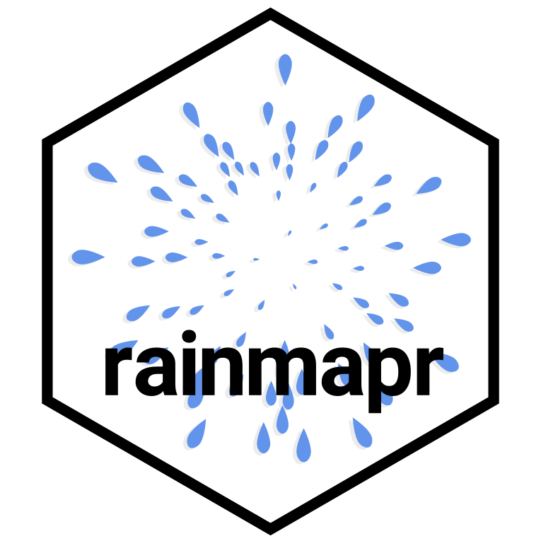

<!-- README.md is generated from README.Rmd. Please edit that file -->

```{r, include = FALSE}
knitr::opts_chunk$set(
  collapse = TRUE,
  comment = "#>",
  fig.path = "man/figures/README-",
  out.width = "100%"
)
```

# rainmapr 
`rainmapr` is an R-package that allows you to download CHIRPS data in raster
format. At the moment, data can only be downloaded globally. Data is available
at 0.25 and 0.05 degrees resolution and either as daily or monthly averaged
product.

## Installation
You can install the development version of rainmapr from
[GitHub](https://github.com/) with:
``` r
# install.packages("devtools")
devtools::install_github("DavidDHofmann/rainmapr")
```

## Example
Here is a little example how you can download data

```{r, echo = T, warning = F, message = F}
# Load required packages
library(terra)
library(rainmapr)

# Download chirps data
chirps_files <- getCHIRPS(
    tres      = "monthly"
  , sres      = 0.05
  , dates     = c("2020-06-01", "2020-12-01")
  , dsn       = tempdir()
  , overwrite = T
)

# Load data into the r session
r <- rast(chirps_files)

# Reclassify values for easier plotting
r <- classify(r, rcl = cbind(-Inf, 0, NA))

# Visualize
plot(r, nr = 2)
```